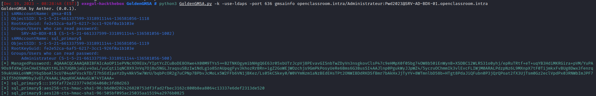
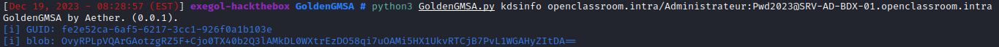
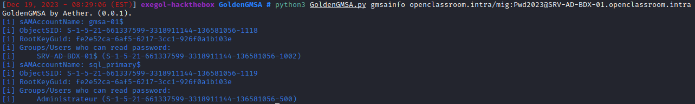

<p align="center">
    A python script to list gMSA account and KDS Key.
    <br>
    
    
    <a href="https://twitter.com/intent/follow?screen_name=san__yohan" title="Follow"></a>
    <br>
</p>

## Installation

You can install it from pypi (latest version is ) with this command:

```bash
sudo python3 -m pip install GoldenGMSA
```

OR from source :

```bash
git clone https://github.com/AetherBlack/GoldenGMSA
cd GoldenGMSA
sudo python3 -m pip install -r requirements.txt
sudo python3 setup.py install
```

OR with pipx :

```bash
python3 -m pipx install git+https://github.com/AetherBlack/GoldenGMSA/
```

## Examples

- You want to list gMSA accounts with Kerberos Authentication:

```bash
GoldenGMSA -k -use-ldaps -port 636 gmsainfo $DOMAIN/$USER:"$PASSWORD"@$KDC
```



- You want to list KDS Key:

```bash
GoldenGMSA kdsinfo $DOMAIN/$USER:$PASSWORD
```



- You want to list gMSA accounts:

```bash
GoldenGMSA gmsainfo $DOMAIN/$USER:$PASSWORD
```




## How it works

The tool will connect to the DC's LDAP to list gMSA and their `msDS-ManagedPassword` if possible.

---

## Credits

- [@Semperis](https://github.com/Semperis) for developping [GoldenGMSA in C#](https://github.com/Semperis/GoldenGMSA)
- [@fortra](https://github.com/fortra/) for developping [impacket](https://github.com/fortra/impacket)

## License

[GNU General Public License v3.0](./LICENSE)
